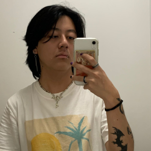

<h1>☕ COFFEE4C0DE 💻</h1>

## Sobre nós

👋 Olá! Seja bem-vind@ à página do GitHub da COFFEE4C0DE! Somos um grupo de estudantes, desenvolvedores e amantes de café! ❤️☕

## Objetivos 🎯

Criação de projetos que resolvam desafiadores e que instiguem nossa criativade

## 💪 Nossa equipe (A-Z) 💪

<table align="center">
  <tr>
    <td align="center">
      
      
Alessandra Shiguemori 🦊

      <a href="https://www.linkedin.com/in/alessandra-shiguemori-32368131/">  Linkedin</a>
       
      <a href="https://github.com/foxczie">  Github</a>
    </td>
    <td align="center">
      
      
Diogo Antonny 

      <a href="https://www.linkedin.com/in/diogo-antonny/">  Linkedin</a>
       
      <a href="https://github.com/DiogoJP202">  Github</a>
    </td>
  </tr>
  <tr>
    <td align="center">
      
      
Giovanni Rodrigues 🎮

      <a href="https://www.linkedin.com/in/giovanni-rodrigues-5b2259325/">  Linkedin</a>
       
      <a href="https://github.com/GioDev29">  Github</a>
    </td>
    <td align="center">
      
      
Rodrigo Tomya 🐉

      <a href="https://www.linkedin.com/in/rodrigo-tomya-maruyama-7483462ab/">  Linkedin</a>
       
      <a href="https://github.com/DigoTomya">  Github</a>
    </td>
  </tr>
  <tr>
    <td align="center">
      
      
Sâmea Silva 

      <a href="https://www.linkedin.com/in/samea-silva/">  Linkedin</a>
       
      <a href="https://github.com/samea-jesus0">  Github</a>
    </td>
    <td></td>
  </tr>
</table>
